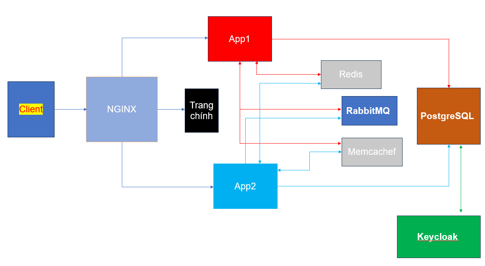

Đây là hệ thống microservices với Docker compose 

Mô tả 

Các thành phần chính 

Nginx : Reverse proxy để điều hướng các request đến các udung backend .

App1 và App2 : 2 ứng dụng spring bôt .

Keycloak : Dịch vụ xác thực và quản lý người dùng , phân quyền  .

PostgreSQL : Lưu trữ dữ liệu cho Keycloak và các ứng dụng Spring Boot.

Redis: Dịch vụ caching , lưu trữ cache hoặc session.

Memcached: Lưu trữ cache phân tán.

RabbitMQ: Message broker để giao tiếp giữa các dịch vụ.

Luồng dữ liệu:
1.Client gửi yêu cầu đến Nginx qua cổng 8888.

2.Nginx điều hướng yêu cầu đến các dịch vụ backend:
/app1 → App1.
/app2 → App2.
Truy cập trực tiếp → Trang chính.

3.App1 và App2 tương tác với các dịch vụ phụ trợ:
-PostgreSQL để lưu trữ dữ liệu.

-Redis và Memcached để caching.

-RabbitMQ để xử lý message.

3.Keycloak quản lý xác thực và tương tác với PostgreSQL để lưu trữ dữ liệu người dùng.

Dưới đây là sơ đồ hoạt động :

